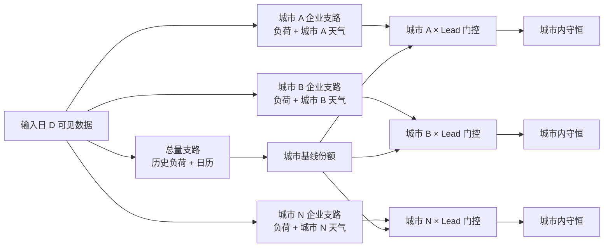

# TimesFM 3.0 多城市负荷预测的城市隔离天气门控

一个不包含生产数据、模型权重或业务系统代码的参考实现，用于把天气协变量安全地接入多城市、企业级负荷预测。

核心问题不是“把所有城市天气拼进一个大向量”，而是控制天气影响的作用域：**某城市的天气只能影响该城市的企业支路**，同时用独立的省级/区域总量支路提供稳定基线。

> 研究用途提示：本仓库采用 MIT 许可证，但不包含 TimesFM。Google 官方 TimesFM 3.0 权重受单独的 `TimesFM Non-Commercial License v1.0` 约束，目前限制商业和生产使用。使用者必须自行核验并遵守上游许可证。

## 方法概览



### 1. 双支路解耦

- **总量支路**：只使用截至输入日 `D` 可见的历史负荷和日历标签，不把任何单个城市的天气或极端天气标签伪装成区域天气。
- **企业支路**：按城市分组；每组包含该城市企业负荷序列与该城市天气协变量。TimesFM 3.0 的多变量能力可作为此支路的预测器，但门控方法本身与模型无关。

总量支路给出区域总负荷预测 `T(h)`，再按截至 `D` 的历史负荷份额得到城市基线 `B_c(h)`；企业支路汇总得到 `E_c(h)`。

### 2. 防泄漏天气口径

- 训练天气、阈值和收益开关只能使用历史时点当时可见的预报快照。
- 生产只能使用输入日 `D` 已经可见的未来天气预报。
- 若没有历史预报归档，历史实况天气只能做“天气响应研究”，不能冒充无泄漏生产回测。
- 阈值合同与数据快照绑定，禁止直接跨数据快照、跨城市复用。

### 3. 城市级天气变化检测

对城市 `c` 和目标日 `D+L`，把目标日24小时预报曲线与参考天气曲线对齐，计算：

`ΔT_c = mean_h |T_target(c,h) - T_ref(c,h)|`

`ΔW_c = mean_h |W_target(c,h) - W_ref(c,h)|`

同时可记录日均温变化、最高/最低温水平和持续时长。每个城市分别从历史无泄漏样本分布中估计阈值。默认参考实现使用分位数，实际项目应把分位点作为验证超参数并冻结到版本合同。

原始天气触发条件为：

`raw_trigger = temperature_hit OR wind_hit`

降雨、湿度、辐射可以作为企业支路协变量，但不建议在证据不足时单独触发整城切换。

### 4. 城市 × 提前量收益门控

达到天气阈值并不自动切换。对每个 `城市 × Lead`，在开发集比较：

`gain_d = |y_d - B_d| - |y_d - E_d|`

只有同时满足以下条件才允许切换：

1. 触发日期不少于5天；
2. 开发集总收益为正；
3. 正收益日期比例不低于60%。

独立终验集只记录泛化证据，不能再用于反选开关。这样可避免在最终测试集上挑选城市或提前量。

### 5. 整城切换与回退

对城市 `c`：

`C_c(h) = E_c(h)`，当且仅当天气触发且该城市/Lead开关启用；否则 `C_c(h) = B_c(h)`。

整城切换避免逐企业噪声化门控。若 `E_c(h) / B_c(h)` 超出硬边界（参考值 `[0.75, 1.25]`），只回退该城市的基线，不影响其他城市。

最后把该城市内的企业预测同比缩放到 `C_c(h)`，保证：

`sum_i prediction(c,i,h) = C_c(h)`

不把一个城市的天气残差分摊给另一个城市。区域总量支路继续作为独立审计锚点，同时报告城市汇总与总量支路的差异。

## 快速开始

```bash
python -m pip install -e .
python examples/synthetic_demo.py
python -m unittest discover -s tests -v
```

`examples/synthetic_demo.py` 仅使用合成的 `City-A`、`City-B` 数据，不调用 TimesFM，也不下载权重。

## 如何接入 TimesFM 3.0

1. 先生成区域总量预测与每个城市的企业预测；
2. 从输入日 `D` 的冻结天气快照构造 `WeatherCurve`；
3. 用 `WeatherGate.decide()` 得到每城市、每 Lead 的门控决定；
4. 用 `select_city_total()` 做整城切换及硬边界回退；
5. 用 `reconcile_enterprises()` 做城市内部守恒；
6. 保存阈值、收益证据、天气快照哈希和每次门控原因以便审计。

本仓库刻意不实现 TimesFM 推理器，以免把门控逻辑与特定框架绑定，也避免误分发受单独许可证约束的权重。

## 建议的验证矩阵

- Lead：`D+3` 到 `D+9` 分开验证；
- 场景：常规日、极端天气、节假日分层；
- 指标：总量 WMAPE、城市 WMAPE、企业 WMAPE、有向偏差率；
- 对照：总量基线、企业支路、门控结果三者同窗比较；
- 稳定性：按月份交错划分开发集与独立终验集；
- 审计：记录每个城市的触发次数、切换次数、回退次数和终验收益。

## 数据安全

`.gitignore` 默认排除 `data/`、`checkpoints/` 和 `*.safetensors`。公开前仍应执行密钥和敏感字段扫描，确保没有企业名称、企业编码、邮箱、内部路径、数据库或真实预测结果。

## 上游资料

- [Google Research: TimesFM-3](https://www.research.google/blog/timesfm-3-a-zero-shot-foundation-model-for-multivariate-forecasting/)
- [Google Research TimesFM GitHub](https://github.com/google-research/timesfm)
- [TimesFM 3.0 模型许可证](https://huggingface.co/google/timesfm-3.0-pytorch/blob/main/LICENSE)

## Further architecture notes

- [City gate evaluation without leakage](docs/city-gate-evaluation.md) — Weather-vintage validation, regional-versus-city metrics, and city-level conservation checks.
